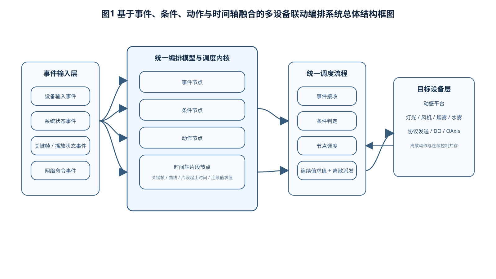
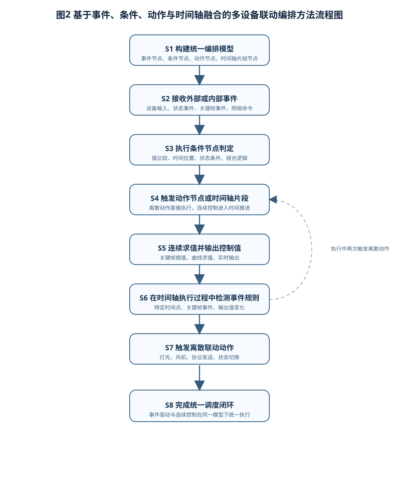
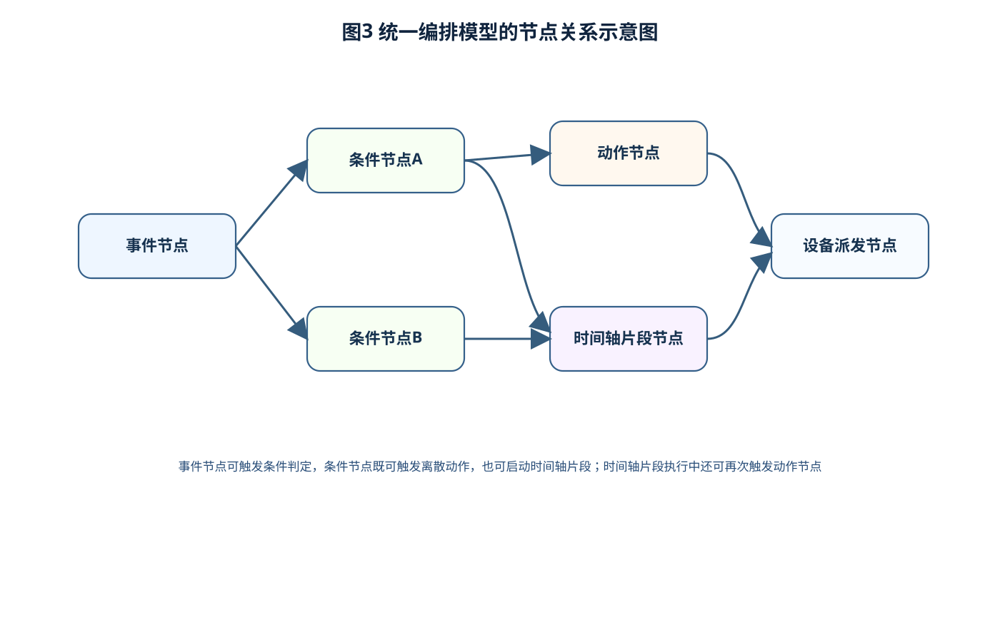
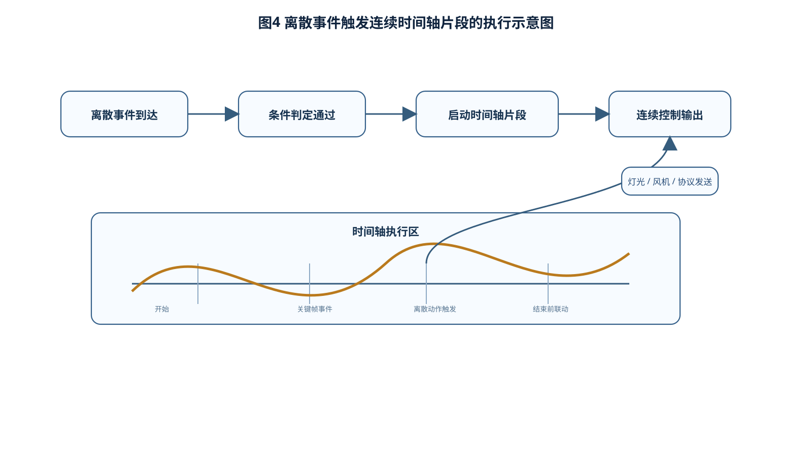

# 说明书摘要

本发明涉及设备联动控制、时间轴编排与事件驱动融合技术领域，尤其涉及一种基于事件、条件、动作与时间轴融合的多设备联动编排方法及系统。所述方法适用于既包含离散触发逻辑又包含连续变化控制逻辑的多设备联动场景。所述方法包括：构建统一编排模型，所述统一编排模型至少包括事件节点、条件节点、动作节点和时间轴片段节点；接收外部事件或内部事件，并根据所述事件触发与之关联的条件判定；在条件满足时，触发对应动作节点或时间轴片段节点执行；在时间轴片段执行过程中，根据预设触发规则输出连续控制值，并在满足事件条件时触发离散联动动作；将离散事件触发逻辑与连续时间轴控制逻辑在同一执行模型下统一调度。通过将事件、条件、动作规则与时间轴片段统一建模和统一执行，本发明能够解决传统方案中离散联动规则与连续控制逻辑分离实现、难以在同一业务流程中统一表达的问题，提高多设备联动编排的表达能力、执行一致性与场景适配能力，适用于动感平台、灯光、风机、烟雾以及其他多设备协同控制场景。

# 摘要附图

建议摘要附图为图1。

图1示出本发明一种基于事件、条件、动作与时间轴融合的多设备联动编排系统总体结构框图。

# 权利要求书

1. 一种基于事件、条件、动作与时间轴融合的多设备联动编排方法，其特征在于，包括如下步骤：

S1、构建统一编排模型，所述统一编排模型包括事件节点、条件节点、动作节点和时间轴片段节点中的两种或多种；

S2、接收外部事件或内部事件，并将所述事件与所述统一编排模型中的事件节点进行匹配；

S3、基于匹配结果执行条件节点判定，当判定结果满足预设条件时，触发动作节点或时间轴片段节点执行；

S4、在时间轴片段节点执行过程中，按照时间推进结果输出连续控制值；

S5、在时间轴片段节点执行过程中，根据预设规则检测事件触发条件，当检测到满足条件的事件时，触发与所述时间轴片段关联的动作节点执行；

S6、将离散事件触发逻辑与连续时间轴控制逻辑在同一调度流程中统一执行，以完成多设备联动编排。

2. 根据权利要求1所述的方法，其特征在于，所述事件节点包括以下至少一种：设备输入事件、系统状态事件、关键帧事件、播放状态事件、网络命令事件。

3. 根据权利要求1所述的方法，其特征在于，所述条件节点用于对以下至少一种条件进行判定：事件类型匹配条件、通道值比较条件、设备状态条件、时间位置条件、组合逻辑条件。

4. 根据权利要求1所述的方法，其特征在于，所述动作节点包括以下至少一种：开关控制动作、协议发送动作、设备输出动作、编排状态切换动作。

5. 根据权利要求1所述的方法，其特征在于，所述时间轴片段节点包括以下至少一种控制参数：目标设备标识、目标通道标识、关键帧序列、插值类型、片段起止时间。

6. 根据权利要求1所述的方法，其特征在于，所述步骤 S3 包括：

在离散事件触发后，根据条件节点判定结果选择直接执行动作节点，或者启动与所述事件节点关联的时间轴片段节点。

7. 根据权利要求1所述的方法，其特征在于，所述步骤 S5 包括：

在时间轴片段节点执行过程中，根据关键帧事件、时间位置或输出值变化满足预设规则时触发离散联动动作。

8. 根据权利要求1所述的方法，其特征在于，所述统一调度流程按照事件接收、条件判定、节点调度、时间推进、连续值求值和动作派发的顺序循环执行。

9. 一种基于事件、条件、动作与时间轴融合的多设备联动编排系统，其特征在于，包括：

统一模型构建模块，用于构建包括事件节点、条件节点、动作节点和时间轴片段节点的统一编排模型；

事件接收模块，用于接收外部事件或内部事件；

条件判定模块，用于根据事件匹配结果执行条件节点判定；

节点调度模块，用于在条件满足时触发动作节点或时间轴片段节点执行；

时间轴执行模块，用于在时间轴片段节点执行过程中输出连续控制值；

联动派发模块，用于将离散动作和连续控制结果派发至目标设备。

10. 一种电子设备，包括处理器和存储器，所述存储器中存储有计算机程序，所述计算机程序被所述处理器执行时实现权利要求1至8任一项所述的方法。

11. 一种计算机可读存储介质，其上存储有计算机程序，所述计算机程序被处理器执行时实现权利要求1至8任一项所述的方法。

# 说明书

## 一种基于事件、条件、动作与时间轴融合的多设备联动编排方法及系统

## 技术领域

本发明涉及多设备联动控制、事件驱动编排、时间轴控制与连续值求值技术领域，尤其涉及一种基于事件、条件、动作与时间轴融合的多设备联动编排方法及系统。

## 背景技术

在多设备联动控制场景中，经常同时存在两类控制需求：一类为离散控制需求，例如当某个输入事件发生时触发灯光开关、风机启动或协议发送；另一类为连续控制需求，例如对动感平台、风速、亮度等连续变化参数按照时间轴进行编排输出。现有技术中，这两类需求通常由不同系统或不同模块分别实现。

传统事件驱动规则擅长处理“事件 - 条件 - 动作”形式的离散联动，但对随时间连续变化的控制片段表达能力较弱；而传统时间轴系统擅长处理关键帧、曲线和连续值输出，但通常难以与条件判断、事件触发及复杂离散联动规则进行统一建模。由此导致在同一业务场景中，离散联动逻辑与连续控制逻辑被割裂处理，不仅增加了系统实现复杂度，也降低了业务流程的整体可视化表达能力和执行一致性。

此外，在动感平台、灯光、风机、烟雾、水雾以及其他执行设备协同工作时，往往需要实现如下复合控制：某一事件触发后启动连续动作片段；在连续动作片段执行到特定时间点时触发离散设备动作；或者根据连续输出值变化和实时状态进一步触发新的离散动作。现有方案缺乏一种能够统一描述并统一调度上述复合逻辑的编排方法。

因此，需要一种将事件、条件、动作规则与时间轴控制片段统一建模并统一执行的多设备联动编排方法及系统，以解决现有技术中离散联动与连续控制割裂实现的问题。

## 发明内容

### （一）发明目的

本发明的目的在于提供一种基于事件、条件、动作与时间轴融合的多设备联动编排方法及系统，以解决现有技术中离散联动规则与连续时间轴控制逻辑难以在同一模型中统一表达和执行的问题。

### （二）技术方案

为实现上述目的，本发明采用如下技术方案：

一种基于事件、条件、动作与时间轴融合的多设备联动编排方法，包括：构建统一编排模型，所述统一编排模型包括事件节点、条件节点、动作节点和时间轴片段节点；接收外部事件或内部事件，并根据事件节点匹配结果执行条件节点判定；当条件满足时，触发动作节点或时间轴片段节点执行；在时间轴片段执行过程中输出连续控制值；在时间轴片段执行过程中根据预设规则触发离散动作节点；从而将离散事件逻辑与连续时间轴逻辑在同一调度链路中统一执行。

优选地，所述事件节点可包括设备输入事件、系统状态事件、关键帧事件、播放状态事件和网络命令事件等。

优选地，所述条件节点可包括基于事件类型、通道值、设备状态、时间位置及组合逻辑的条件判定。

优选地，所述动作节点可包括开关类动作、协议发送动作、设备输出动作以及编排状态切换动作等。

优选地，所述时间轴片段节点至少包含目标设备、目标通道、关键帧序列、插值方式和片段起止时间等信息，用于在执行阶段产生连续控制值。

优选地，所述统一调度流程可包括：事件接收、条件判定、节点调度、时间推进、连续值求值和动作派发。离散事件触发连续片段，连续片段又可反向触发离散动作，从而实现双向融合。

本发明还提供一种基于事件、条件、动作与时间轴融合的多设备联动编排系统，包括统一模型构建模块、事件接收模块、条件判定模块、节点调度模块、时间轴执行模块和联动派发模块，用于协同执行上述方法。

本发明还提供一种电子设备以及一种计算机可读存储介质，用于实现上述方法。

### （三）有益效果

与现有技术相比，本发明至少具有以下有益效果：

1. 通过统一编排模型同时表达事件、条件、动作与时间轴片段，能够在同一业务视图中描述离散联动与连续控制，提高编排表达能力。

2. 通过统一调度流程执行离散事件逻辑和连续时间轴逻辑，能够避免两套执行系统并存带来的状态不一致和协同复杂度问题。

3. 通过支持“事件触发时间轴片段”以及“时间轴片段反向触发离散动作”的双向联动，能够覆盖更复杂的多设备协同场景。

4. 通过条件节点统一承载判定逻辑，能够使业务人员在编排时显式描述触发条件、时机和动作关系，提升流程可读性和可维护性。

5. 本发明适用于动感平台与特效设备联动，也适用于其他需要离散规则与连续过程同时参与控制的多设备系统。

## 附图说明

图1为本发明一种基于事件、条件、动作与时间轴融合的多设备联动编排系统总体结构框图。

图2为本发明一种基于事件、条件、动作与时间轴融合的多设备联动编排方法流程图。

图3为本发明中统一编排模型的节点关系示意图。

图4为本发明中离散事件触发连续时间轴片段的执行示意图。

图5为本发明中时间轴片段反向触发离散动作的执行示意图。

## 具体实施方式

以下结合附图和具体实施例对本发明作进一步详细说明。应当理解，以下实施例仅用于说明本发明，而不用于限制本发明的保护范围。

### 实施例一：统一编排模型构建实施例

在本实施例中，系统首先建立统一编排模型。所述统一编排模型包括事件节点、条件节点、动作节点和时间轴片段节点。事件节点用于表示输入事件、关键帧事件、状态事件或外部控制事件；条件节点用于描述事件匹配后需满足的判定条件；动作节点用于表示离散控制动作；时间轴片段节点用于表示连续变化控制过程。

在编排阶段，用户可将离散规则和连续片段统一组织在同一模型中。例如，将“按钮按下”设置为事件节点，将“当前设备处于就绪状态”设置为条件节点，将“启动风机”设置为动作节点，将“播放 5 秒动感片段”设置为时间轴片段节点。通过节点之间的关联关系即可完整表达复合联动逻辑。

### 实施例二：离散事件触发连续时间轴片段实施例

在本实施例中，当系统接收到某一输入事件，例如按键事件、外部命令事件或设备状态变化事件时，事件接收模块首先将该事件与统一编排模型中的事件节点进行匹配。若匹配成功，则由条件判定模块对与该事件节点关联的条件节点进行判定。

当判定结果满足预设条件时，节点调度模块启动与该事件节点关联的时间轴片段节点执行。时间轴执行模块在时间推进过程中，根据时间轴片段中的关键帧、插值方式和目标通道信息连续输出控制值，并将连续输出值派发到目标设备。

例如，在动感平台应用场景中，按键事件可触发某一段持续 5 秒的姿态变化曲线片段执行，从而实现由离散事件引发的连续控制过程。

### 实施例三：时间轴片段反向触发离散动作实施例

在本实施例中，时间轴片段节点在执行过程中不仅连续输出控制值，还可以在时间达到预设位置、关键帧事件触发或输出值满足阈值条件时，触发动作节点执行。

例如，当动感片段播放至第 2 秒时，系统触发灯光闪烁动作；当风速曲线达到某一阈值时，系统触发烟雾设备启动；当关键帧事件发生时，系统发送一条协议控制命令。通过该方式，连续控制逻辑能够反向驱动离散联动动作，实现双向融合。

### 实施例四：统一调度流程实施例

在本实施例中，系统采用统一调度流程对离散事件逻辑与连续时间轴逻辑进行统一执行。所述调度流程可包括如下阶段：

S401、接收事件；

S402、执行条件判定；

S403、调度动作节点或时间轴片段节点；

S404、推进时间轴执行时间；

S405、计算连续控制值；

S406、派发离散动作和连续控制值。

通过该统一流程，系统无须将离散联动引擎与时间轴引擎拆分为两个独立体系，而是以相同调度框架对两者进行集中管理，从而提升执行一致性。

### 实施例五：多设备场景实施例

本发明适用于多种设备联动场景。例如，在动感平台与特效设备联动场景中，可通过时间轴片段控制平台姿态连续变化，同时在关键节点触发灯光、风机和烟雾设备动作；在一般工业控制场景中，也可通过事件节点、条件节点与连续控制片段的组合，实现输入触发与连续输出协同控制。

需要说明的是，以上实施例中所列举的节点类型、调度顺序、事件类型、动作类型以及时间轴片段结构仅为优选示例，本领域技术人员在不脱离本发明实质的前提下可以作出各种等同替换或变形，这些等同替换或变形均应落入本发明的保护范围。

## 说明书附图

图1：系统总体结构框图。

图2：方法流程图。

图3：统一编排模型节点关系示意图。

图4：离散事件触发连续时间轴片段示意图。

图5：时间轴片段触发离散动作示意图。
