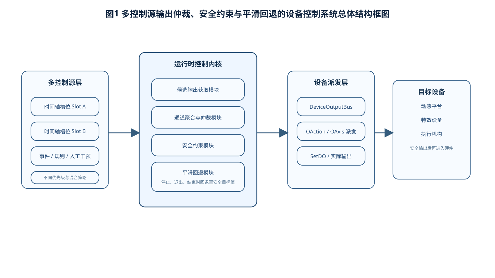
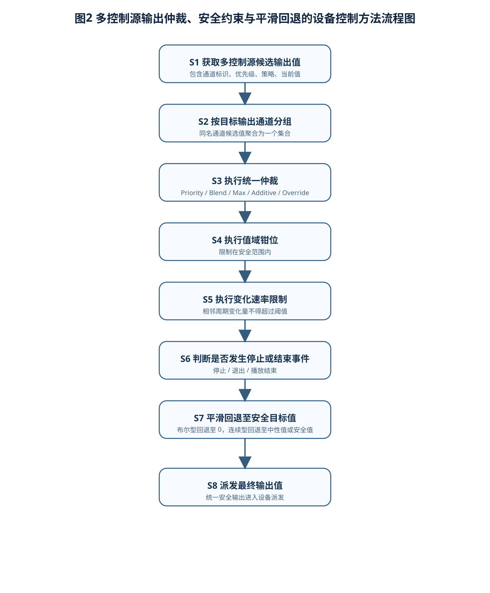
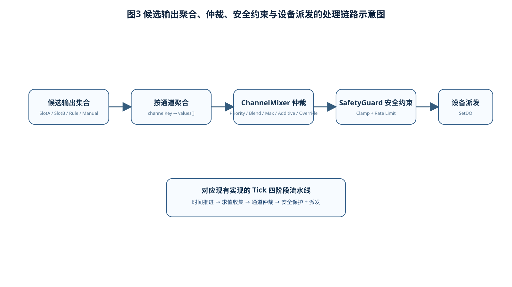
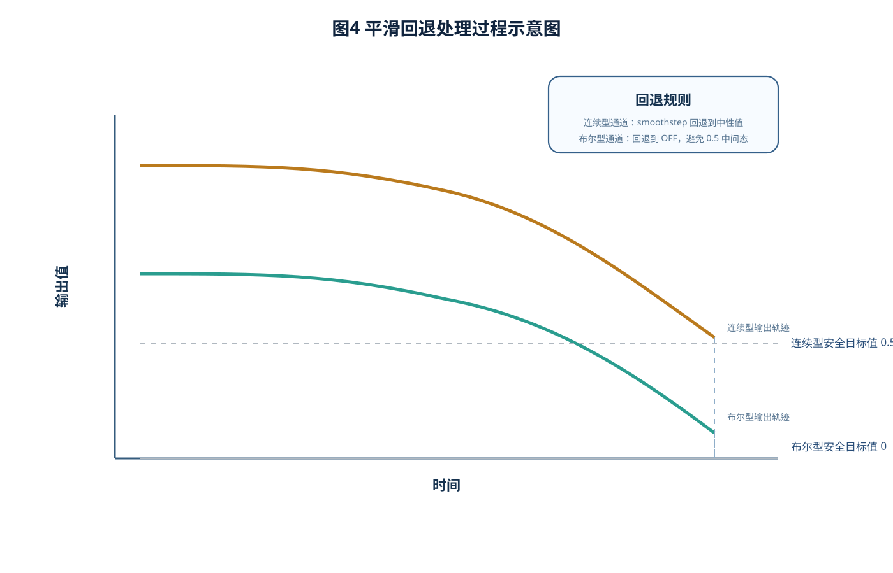

# 说明书摘要

本发明涉及设备控制与时序编排技术领域，尤其涉及一种多控制源输出仲裁、安全约束与平滑回退的设备控制方法及系统。所述方法适用于多流程、多槽位或多策略并发作用于同一目标设备输出通道的控制场景。所述方法包括：在周期性驱动过程中获取多个控制源针对同一目标通道产生的候选输出值；基于候选输出值对应的优先级和混合策略，对同一目标通道的多个候选输出值进行统一仲裁，得到仲裁输出值；对仲裁输出值执行安全约束处理，所述安全约束处理至少包括输出值域钳位和变化速率限制；在接收到停止指令、退出指令或播放结束事件时，按照与通道类型对应的安全目标值和预设回退函数，对当前输出值执行平滑回退处理；将经安全约束处理或平滑回退处理后的最终输出值派发至目标设备。通过将多控制源输出合成、安全保护和平滑回退置于同一处理链路中，本发明能够避免多控制源并发控制时的输出冲突、异常跳变和危险状态，提升设备控制结果的一致性、可预期性和安全性，尤其适用于动感平台、特效设备及其他多执行器协同控制场景。

# 摘要附图

建议摘要附图为图1。

图1示出本发明一种多控制源输出仲裁、安全约束与平滑回退的设备控制系统总体结构框图。

# 权利要求书

1. 一种多控制源输出仲裁、安全约束与平滑回退的设备控制方法，其特征在于，包括如下步骤：

S1、在周期性控制驱动过程中，获取多个控制源针对目标设备的同一目标输出通道产生的候选输出值，其中，每一候选输出值至少关联有通道标识、控制源标识以及用于表征输出合成方式的仲裁参数；

S2、按照目标输出通道对所述候选输出值进行分组，得到各目标输出通道对应的候选输出集合；

S3、针对每一目标输出通道对应的候选输出集合，根据预设仲裁策略对多个候选输出值进行统一仲裁，得到对应的仲裁输出值；

S4、对所述仲裁输出值执行安全约束处理，所述安全约束处理至少包括输出值域钳位处理和变化速率限制处理，得到安全输出值；

S5、当检测到停止事件、退出事件或结束事件时，基于目标输出通道对应的安全目标值，对当前输出值执行平滑回退处理，得到回退输出值；

S6、将所述安全输出值或回退输出值作为最终输出值派发至目标设备。

2. 根据权利要求1所述的设备控制方法，其特征在于，所述控制源包括以下至少两项中的两项或多项：时间轴播放槽位、事件触发流程、规则执行流程、人工干预流程。

3. 根据权利要求1所述的设备控制方法，其特征在于，所述仲裁策略包括以下任一种或多种：优先级生效策略、平均混合策略、最大值生效策略、累加叠加策略和后接入覆盖策略；其中：

优先级生效策略用于选取优先级最高的候选输出值作为仲裁输出值；

平均混合策略用于对多个候选输出值进行平均运算得到仲裁输出值；

最大值生效策略用于选取多个候选输出值中的最大值作为仲裁输出值；

累加叠加策略用于对多个候选输出值进行求和并对求和值进行值域限制；

后接入覆盖策略用于以后接入控制源对应的候选输出值作为仲裁输出值。

4. 根据权利要求1所述的设备控制方法，其特征在于，所述输出值域钳位处理用于将仲裁输出值限定在预设安全范围内，所述变化速率限制处理用于按照单位时间内允许的最大变化量限制相邻两个控制周期之间输出值的变化幅度。

5. 根据权利要求4所述的设备控制方法，其特征在于，所述变化速率限制处理包括：根据当前控制周期时长和预设最大变化速率计算允许变化阈值；将当前周期仲裁输出值与上一周期最终输出值之间的差值限定在所述允许变化阈值范围内，以得到当前周期的安全输出值。

6. 根据权利要求1所述的设备控制方法，其特征在于，所述平滑回退处理包括：根据目标输出通道的通道类型确定对应的安全目标值，并按照预设平滑函数将当前输出值在预设回退时长内渐变至所述安全目标值；其中，布尔型输出通道的安全目标值为关闭值，连续型输出通道的安全目标值为中性值或预设安全值。

7. 根据权利要求6所述的设备控制方法，其特征在于，所述预设平滑函数为 smoothstep 函数、缓入缓出函数或其他连续单调函数中的任一种。

8. 根据权利要求1所述的设备控制方法，其特征在于，所述周期性控制驱动过程至少按照如下顺序执行：时间推进、候选输出求值收集、输出仲裁、安全约束处理以及设备派发。

9. 一种多控制源输出仲裁、安全约束与平滑回退的设备控制系统，其特征在于，包括：

候选输出获取模块，用于在周期性控制驱动过程中获取多个控制源针对同一目标输出通道产生的候选输出值；

分组模块，用于按照目标输出通道对所述候选输出值进行分组；

仲裁模块，用于根据预设仲裁策略对每一目标输出通道对应的多个候选输出值进行统一仲裁，得到仲裁输出值；

安全约束模块，用于对仲裁输出值执行输出值域钳位处理和变化速率限制处理；

平滑回退模块，用于在检测到停止事件、退出事件或结束事件时，基于目标输出通道对应的安全目标值对当前输出值执行平滑回退处理；

设备派发模块，用于将安全约束模块输出的安全输出值或平滑回退模块输出的回退输出值派发至目标设备。

10. 一种电子设备，包括处理器和存储器，所述存储器中存储有计算机程序，所述计算机程序被所述处理器执行时实现权利要求1至8任一项所述的方法。

11. 一种计算机可读存储介质，其上存储有计算机程序，所述计算机程序被处理器执行时实现权利要求1至8任一项所述的方法。

# 说明书

## 一种多控制源输出仲裁、安全约束与平滑回退的设备控制方法及系统

## 技术领域

本发明涉及设备控制、工业控制软件、时序编排与输出安全保护技术领域，尤其涉及一种适用于多流程、多槽位或多策略并发控制场景的多控制源输出仲裁、安全约束与平滑回退的设备控制方法及系统。

## 背景技术

在动感平台、灯光、风机、烟雾、水雾以及其他执行机构的控制场景中，同一目标输出通道往往并非只受单一控制源驱动，而可能同时受到多个播放流程、多个时间轴槽位、事件触发规则或者人工控制指令的共同影响。现有技术中，针对同一目标通道的多源控制通常采用以下处理方式：其一，简单以前一控制源或后一控制源覆盖另一控制源；其二，对不同控制功能分别设置独立处理逻辑，由多个模块各自修改输出结果；其三，仅对单一控制过程进行安全限制，而未对多源合成后的最终结果进行统一安全处理。

上述处理方式至少存在以下问题：第一，多控制源并发作用时，不同控制源之间容易出现输出冲突，导致控制结果不可预期；第二，若多个模块分别在不同阶段各自执行约束或修正处理，可能造成仲裁顺序混乱，使最终输出结果与设计意图不一致；第三，在停止播放、异常退出或流程结束时，若直接归零、立即切换到默认值或不区分通道类型进行统一回退，则容易造成设备突变、机械冲击、危险状态或业务语义错误；第四，对于布尔型通道与连续型通道，现有方案通常缺乏差异化的安全目标值设置与回退处理机制。

因此，需要一种能够将多控制源输出合成、安全约束与平滑回退统一纳入同一控制链路中的设备控制方法及系统，以解决多控制源并发控制下的输出冲突、异常跳变和安全性不足的问题。

## 发明内容

### （一）发明目的

本发明的目的在于提供一种多控制源输出仲裁、安全约束与平滑回退的设备控制方法及系统，用以解决现有技术中多控制源并发控制同一目标输出通道时存在的输出冲突、控制结果不一致、异常跳变以及停止过程不安全的问题。

### （二）技术方案

为实现上述目的，本发明采用如下技术方案：

一种多控制源输出仲裁、安全约束与平滑回退的设备控制方法，在周期性控制驱动过程中，首先获取多个控制源针对同一目标输出通道产生的候选输出值，并按照目标输出通道对候选输出值进行聚合；随后，根据候选输出值所关联的优先级和混合策略对候选输出值进行仲裁，得到仲裁输出值；接着，对仲裁输出值执行统一的安全约束处理，所述安全约束处理至少包括输出值域钳位和变化速率限制；在检测到停止事件、退出事件或结束事件时，再根据通道类型对应的安全目标值对当前输出值执行平滑回退；最后，将安全约束处理后的输出值或平滑回退后的输出值派发至目标设备。

优选地，所述控制源可以包括多个时间轴播放槽位、多个规则流程、多个事件触发流程或人工干预流程中的两项或多项。

优选地，所述仲裁策略包括：

1. 优先级生效策略，用于在多个候选输出值中选取优先级最高的候选输出值；

2. 平均混合策略，用于对多个候选输出值进行平均运算；

3. 最大值生效策略，用于选取多个候选输出值中的最大值；

4. 累加叠加策略，用于将多个候选输出值求和后限制在安全范围内；

5. 后接入覆盖策略，用于以后接入控制源对应的候选输出值作为最终仲裁结果。

优选地，所述安全约束处理至少包括以下两项：

1. 输出值域钳位处理，即将仲裁输出值限制在预设安全区间内；

2. 变化速率限制处理，即根据当前控制周期时长和预设最大变化速率，限制当前周期输出值相对于上一周期最终输出值的变化幅度。

优选地，所述平滑回退处理按照以下方式执行：针对不同类型的目标输出通道，配置不同的安全目标值；当检测到停止事件、退出事件或结束事件时，在预设回退时长内通过连续平滑函数将当前输出值逐步变化至对应的安全目标值。其中，布尔型输出通道的安全目标值为关闭值，连续型输出通道的安全目标值为中性值或预设安全值。

优选地，所述周期性控制驱动过程至少包括时间推进、候选输出求值收集、输出仲裁、安全约束处理以及设备派发五个阶段，并按固定顺序执行。

本发明还提供一种多控制源输出仲裁、安全约束与平滑回退的设备控制系统，包括候选输出获取模块、分组模块、仲裁模块、安全约束模块、平滑回退模块以及设备派发模块，各模块配合执行上述方法。

本发明还提供一种电子设备以及一种计算机可读存储介质，用于实现上述方法。

### （三）有益效果

与现有技术相比，本发明至少具有以下有益效果：

1. 将多控制源输出合成、安全约束和平滑回退统一到同一处理链路中，避免多个独立后处理模块叠加造成的时序混乱和结果不一致问题。

2. 通过按目标输出通道聚合并执行统一仲裁，能够有效解决多个流程、多个槽位或多个策略并发作用于同一目标通道时的输出冲突问题。

3. 将安全约束处理放置于仲裁之后执行，能够保证进入设备派发阶段的是最终合成结果的安全值，而不是各个控制源的局部安全值，从而提升整体控制安全性。

4. 通过基于通道类型设置安全目标值并执行平滑回退，能够避免设备在停止或退出时产生机械冲击、语义错误或危险状态，尤其适用于动感平台及特效设备控制场景。

5. 本发明既适用于动感平台等连续控制设备，也适用于布尔型开关控制和离散触发场景，具有较强的通用性和工程适配能力。

## 附图说明

图1为本发明一种多控制源输出仲裁、安全约束与平滑回退的设备控制系统总体结构框图。

图2为本发明一种多控制源输出仲裁、安全约束与平滑回退的设备控制方法流程图。

图3为本发明中多控制源候选输出值按目标输出通道聚合并执行仲裁、安全约束和设备派发的处理链路示意图。

图4为本发明中平滑回退处理过程示意图。

## 具体实施方式

以下结合附图和具体实施例对本发明作进一步详细说明。应当理解，以下实施例仅用于说明本发明，而不用于限制本发明的保护范围。

### 实施例一：基于多时间轴槽位的统一输出仲裁与安全控制

本实施例以动感平台播控系统为例进行说明。系统中设置有多个时间轴播放槽位，每个时间轴播放槽位可以加载独立的动作编排文件，并在运行过程中对一个或多个目标输出通道产生控制值。多个时间轴播放槽位可能同时作用于同一目标输出通道，例如同一座椅平台的俯仰通道、升降通道、振动通道或特效触发通道。

在本实施例中，系统按照固定控制周期执行如下步骤：

S101、执行时间推进。对处于播放状态的控制源推进当前时间，对处于回退状态的控制源推进回退时间；当控制源播放到末尾且不满足循环条件时，将该控制源切换为回退状态。

S102、执行候选输出求值收集。对于每一处于活动状态的控制源，根据当前时间对其目标输出通道求值得到候选输出值，并生成包含控制源标识、目标输出通道标识、优先级、混合策略以及候选输出值的数据记录。

S103、执行按通道分组。按照目标输出通道标识将多个控制源产生的候选输出值聚合为候选输出集合，以便后续对同一目标输出通道执行统一处理。

S104、执行输出仲裁。针对每一目标输出通道对应的候选输出集合，根据配置的混合策略进行仲裁。例如，当采用优先级生效策略时，选取优先级最高的候选输出值；当采用平均混合策略时，对多个候选输出值求平均；当采用累加叠加策略时，对多个候选输出值求和并进行上限限制。

S105、执行安全约束。对仲裁后的输出值先执行值域钳位，再执行变化速率限制。若上一周期最终输出值记为 Vprev，当前周期仲裁输出值记为 Vmix，控制周期时长记为 Δt，预设最大变化速率记为 R，则允许变化量为 R×Δt，当前周期安全输出值 Vsafe 可表示为：

Vsafe = Vprev + clamp(Vmix - Vprev, -R×Δt, R×Δt)。

S106、执行设备派发。将安全输出值作为当前周期最终输出值，派发至目标设备对应的输出接口。

通过上述步骤，多个时间轴播放槽位产生的输出值在进入设备之前先完成统一仲裁，再执行统一安全约束，从而避免多个时间轴分别修正后再次叠加导致的不可预期结果。

### 实施例二：基于停止事件的分类型平滑回退控制

在本实施例中，当检测到停止指令、流程退出指令或播放结束事件时，系统并不直接将当前输出值切换为零值，而是根据目标输出通道的通道类型和预设安全目标值执行平滑回退处理。

具体地，对于连续型输出通道，例如平台姿态通道、风速通道或亮度通道，安全目标值可设置为中性值 0.5 或其他预设安全值；对于布尔型输出通道，例如开关型特效触发通道，安全目标值设置为关闭值 0。系统在预设回退时长 T 内，通过平滑函数 f(x) 将当前输出值 Vcur 逐步变化至安全目标值 Vtarget，其中 x=t/T，t 为已执行回退的时间。优选地，平滑函数可采用 smoothstep 函数，即：

f(x)=x²×(3-2x)。

则回退过程中的输出值 Vret 可表示为：

Vret = Vcur + (Vtarget - Vcur) × f(x)。

当 t≥T 时，输出值完成回退并进入安全状态。由于针对不同通道类型采用不同的安全目标值，本实施例能够避免将布尔型输出通道错误回退至中间态，从而保持控制语义正确。

### 实施例三：系统结构实施例

如图1所示，本发明提供的设备控制系统包括：

1. 候选输出获取模块，用于在周期性控制驱动过程中从多个控制源获取针对目标输出通道的候选输出值；

2. 分组模块，用于按照目标输出通道对候选输出值进行分组聚合；

3. 仲裁模块，用于根据预设仲裁策略对同一目标输出通道对应的多个候选输出值进行统一仲裁；

4. 安全约束模块，用于对仲裁结果执行输出值域钳位和变化速率限制；

5. 平滑回退模块，用于在停止事件、退出事件或结束事件发生时，将当前输出值按照平滑函数回退至安全目标值；

6. 设备派发模块，用于将最终输出值写入目标设备的输出接口。

在一个优选实施方式中，所述仲裁模块、安全约束模块和平滑回退模块部署于同一运行时控制内核中，并由统一的周期性调度循环驱动执行，以保证处理顺序固定、状态一致且易于验证。

### 实施例四：应用场景实施例

本发明不限于动感平台场景，还可应用于灯光设备、风机设备、烟雾设备、水雾设备、气味发生器或其他受数字量、模拟量或连续量控制的执行设备。当多个编排任务、多个业务流程或多个控制入口同时作用于同一输出通道时，均可采用本发明的方法对候选输出值进行统一仲裁、安全约束和平滑回退。

需要说明的是，以上实施例中所列举的仲裁策略、速率限制参数、回退时长、平滑函数形式和安全目标值仅为优选示例，本领域技术人员在不脱离本发明实质的前提下可以作出各种等同替换或变形，这些等同替换或变形均应落入本发明的保护范围。

## 说明书附图

图1：系统总体结构框图。

图2：方法流程图。

图3：候选输出聚合、仲裁、安全约束与派发链路示意图。

图4：平滑回退处理曲线示意图。

