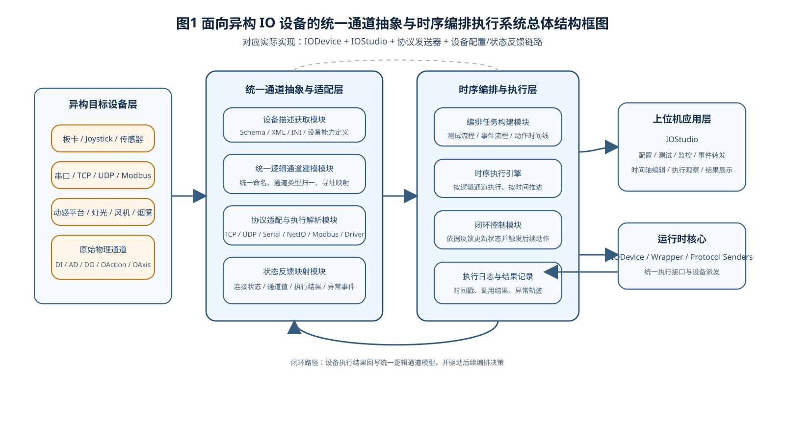
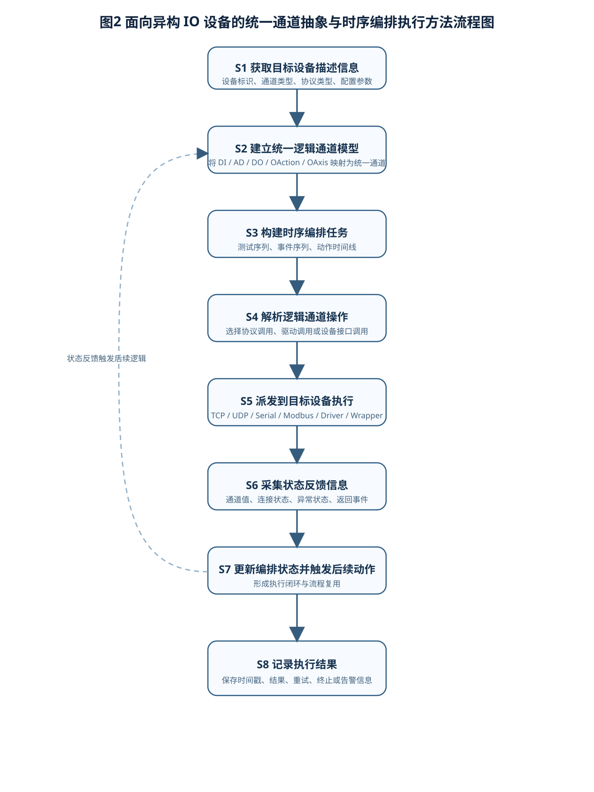
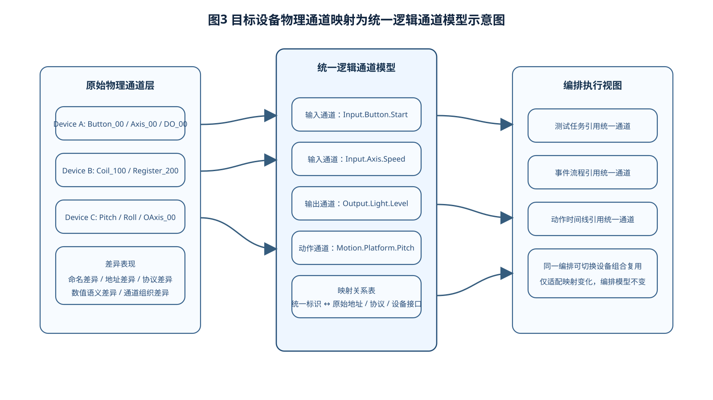
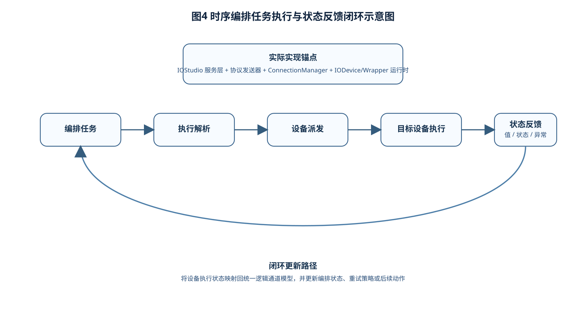

# 说明书摘要

本发明涉及工业控制软件、异构设备接入与时序编排执行技术领域，尤其涉及一种面向异构 IO 设备的统一通道抽象与时序编排执行方法及系统。所述方法适用于不同协议、不同厂商、不同设备模型共存的上位机控制场景。所述方法包括：获取多种目标设备的设备能力描述、协议适配描述和物理通道信息；将所述物理通道映射为统一逻辑通道模型，所述统一逻辑通道模型至少包括输入通道、输出通道、动作通道、轴通道或事件通道中的一种或多种；基于所述统一逻辑通道模型构建可复用的时序编排任务；在执行阶段将编排任务中的逻辑通道操作解析为面向对应目标设备的协议调用或驱动调用；采集目标设备执行后的状态反馈并回写至统一逻辑通道模型，以形成编排执行闭环。通过在设备接入层与编排执行层之间建立统一通道抽象，本发明能够将异构设备的差异性封装在适配层内，使同一测试流程或控制流程能够在不同设备组合上复用，降低多设备系统的集成成本和维护复杂度，提升时序编排执行的一致性、可迁移性和可验证性，适用于设备测试、事件转发、动作执行及多设备联动控制场景。

# 摘要附图

建议摘要附图为图1。

图1示出本发明一种面向异构 IO 设备的统一通道抽象与时序编排执行系统总体结构框图。

# 权利要求书

1. 一种面向异构 IO 设备的统一通道抽象与时序编排执行方法，其特征在于，包括如下步骤：

S1、获取多个目标设备的设备描述信息，所述设备描述信息至少包括设备标识、通道类型、协议类型、驱动接口或配置参数中的一种或多种；

S2、根据所述设备描述信息，将各目标设备的物理通道映射为统一逻辑通道模型，其中，所述统一逻辑通道模型用于屏蔽物理设备之间的协议差异和通道命名差异；

S3、基于所述统一逻辑通道模型构建时序编排任务，所述时序编排任务至少包括逻辑通道标识、时间参数、动作参数或事件参数中的一种或多种；

S4、执行所述时序编排任务，将编排任务中针对逻辑通道的操作解析为与对应目标设备匹配的协议调用或驱动调用；

S5、获取所述目标设备的状态反馈信息，并将所述状态反馈信息映射回所述统一逻辑通道模型；

S6、基于所述状态反馈信息更新所述时序编排任务的执行状态或触发后续编排动作，以形成编排执行闭环。

2. 根据权利要求1所述的方法，其特征在于，所述统一逻辑通道模型包括以下至少一项：数字量输入通道、模拟量输入通道、数字量输出通道、模拟量输出通道、动作通道、轴通道、事件通道。

3. 根据权利要求1所述的方法，其特征在于，所述步骤 S2 包括：

根据目标设备的原始通道名称、原始通道地址或原始通道语义生成统一逻辑通道标识；

建立所述统一逻辑通道标识与目标设备原始通道之间的映射关系表，以供执行阶段进行寻址和派发。

4. 根据权利要求1所述的方法，其特征在于，所述步骤 S3 中的时序编排任务包括以下至少一种：按时间顺序执行的动作序列、按条件触发的事件序列、按周期执行的测试序列。

5. 根据权利要求1所述的方法，其特征在于，所述步骤 S4 包括：

根据统一逻辑通道标识查询对应目标设备的适配规则；

根据所述适配规则将逻辑通道操作转换为 TCP、UDP、串口、Modbus、NetIO 或驱动层函数调用中的任一种或多种；

将转换后的调用结果与执行时间戳相关联保存。

6. 根据权利要求1所述的方法，其特征在于，所述状态反馈信息包括以下至少一项：通道当前值、执行成功状态、异常状态、连接状态、设备返回事件。

7. 根据权利要求1所述的方法，其特征在于，所述步骤 S6 包括：

在状态反馈信息满足预设条件时触发后续逻辑通道操作；

或者在状态反馈信息不满足预设条件时执行重试、告警或流程终止处理。

8. 根据权利要求1所述的方法，其特征在于，所述统一逻辑通道模型与时序编排任务相互独立存储，从而使同一时序编排任务能够在不同目标设备组合之间复用。

9. 一种面向异构 IO 设备的统一通道抽象与时序编排执行系统，其特征在于，包括：

设备描述获取模块，用于获取多个目标设备的设备描述信息；

统一通道建模模块，用于将各目标设备的物理通道映射为统一逻辑通道模型；

编排任务构建模块，用于基于统一逻辑通道模型构建时序编排任务；

执行解析模块，用于将编排任务中的逻辑通道操作解析为协议调用或驱动调用；

状态反馈处理模块，用于接收目标设备的状态反馈信息并映射回统一逻辑通道模型；

闭环控制模块，用于基于状态反馈信息更新编排执行状态或触发后续动作。

10. 一种电子设备，包括处理器和存储器，所述存储器中存储有计算机程序，所述计算机程序被所述处理器执行时实现权利要求1至8任一项所述的方法。

11. 一种计算机可读存储介质，其上存储有计算机程序，所述计算机程序被处理器执行时实现权利要求1至8任一项所述的方法。

# 说明书

## 一种面向异构 IO 设备的统一通道抽象与时序编排执行方法及系统

## 技术领域

本发明涉及异构设备接入、设备控制软件、统一通道建模与时序编排执行技术领域，尤其涉及一种面向异构 IO 设备的统一通道抽象与时序编排执行方法及系统。

## 背景技术

在工业控制、互动体验、设备测试及特效控制等场景中，上位机往往需要同时接入多种不同类型的硬件设备，例如键盘、操纵杆、板卡、动感平台、灯光设备、风机设备、串口设备或基于 TCP、UDP、Modbus、NetIO 等协议的外部设备。这些设备在接口协议、通道命名方式、寻址方式、配置方式以及输入输出模型上均存在显著差异。

现有技术中，对异构设备的处理通常集中在设备接入层或配置管理层，即仅关注如何建立连接、读取数据或写入数据，而缺少一种能够向上提供统一通道语义并支撑时序编排执行的抽象方法。结果是：同一套测试逻辑或控制逻辑一旦更换设备型号或设备组合，就需要重新编写通道映射、调整协议细节或重新实现流程逻辑；不同设备之间难以共用同一套编排模型；设备状态反馈也通常停留在底层，无法统一回写到业务执行模型中。

此外，现有很多方案将“设备接入”“协议转发”“流程编排”“执行反馈”分散在不同模块中独立实现，导致流程描述与设备执行之间存在较强耦合，一方面降低了编排逻辑的可迁移性，另一方面也使得多设备系统的调试、复用和维护成本较高。

因此，需要一种能够在异构设备之上建立统一逻辑通道，并支撑时序编排执行和状态反馈闭环的方法及系统，以解决异构设备场景下流程难复用、执行难统一和状态难回读的问题。

## 发明内容

### （一）发明目的

本发明的目的在于提供一种面向异构 IO 设备的统一通道抽象与时序编排执行方法及系统，以解决现有技术中异构设备协议差异大、通道模型不统一、流程难复用以及状态反馈难以统一闭环的问题。

### （二）技术方案

为实现上述目的，本发明采用如下技术方案：

一种面向异构 IO 设备的统一通道抽象与时序编排执行方法，包括：获取多个目标设备的设备描述信息；将目标设备的物理通道映射为统一逻辑通道模型；基于统一逻辑通道模型构建时序编排任务；在执行阶段将面向逻辑通道的操作解析为与各目标设备对应的协议调用或驱动调用；接收目标设备返回的状态反馈并映射回统一逻辑通道模型；基于反馈结果更新编排执行状态或触发后续动作，从而形成执行闭环。

优选地，所述统一逻辑通道模型可包含数字量输入、模拟量输入、数字量输出、模拟量输出、动作输出、轴输出以及事件通道等多种类型，使不同设备的原始通道在统一模型下被一致表示。

优选地，所述时序编排任务与设备适配规则相分离存储，其中编排任务仅依赖统一逻辑通道标识，不直接依赖具体设备协议，从而使同一编排任务能够迁移至不同设备组合执行。

优选地，所述执行阶段包括：根据逻辑通道标识查询映射关系和适配规则；将逻辑通道操作转换为底层协议或驱动调用；执行所述调用并记录时间戳、执行状态与返回结果。

优选地，所述状态反馈信息可包括通道当前值、执行成功状态、连接状态、异常状态以及设备返回事件中的一种或多种，并用于驱动后续编排任务执行。

本发明还提供一种面向异构 IO 设备的统一通道抽象与时序编排执行系统，包括设备描述获取模块、统一通道建模模块、编排任务构建模块、执行解析模块、状态反馈处理模块以及闭环控制模块，各模块协同执行上述方法。

本发明还提供一种电子设备以及一种计算机可读存储介质，用于实现上述方法。

### （三）有益效果

与现有技术相比，本发明至少具有以下有益效果：

1. 通过在设备层之上建立统一逻辑通道模型，能够屏蔽不同设备在协议、命名和寻址上的差异，提升系统抽象一致性。

2. 通过将编排任务与具体设备适配规则解耦，同一测试流程或控制流程可以在不同设备组合上复用，显著降低系统迁移成本。

3. 通过统一执行解析链路，使逻辑通道操作能够按一致方式转化为多种协议调用或驱动调用，便于多协议、多设备场景下的集中管理。

4. 通过将设备状态反馈回写至统一逻辑通道模型，形成从编排描述到设备执行再到状态回读的闭环，提升执行可验证性和流程可控性。

5. 本发明不仅适用于设备接入管理，还可用于多设备 IO 测试、事件转发、动感编排执行以及其他需要统一控制模型的业务场景。

## 附图说明

图1为本发明一种面向异构 IO 设备的统一通道抽象与时序编排执行系统总体结构框图。

图2为本发明一种面向异构 IO 设备的统一通道抽象与时序编排执行方法流程图。

图3为本发明中目标设备物理通道映射为统一逻辑通道模型的示意图。

图4为本发明中时序编排任务执行与状态反馈闭环示意图。

## 具体实施方式

以下结合附图和具体实施例对本发明作进一步详细说明。应当理解，以下实施例仅用于说明本发明，而不用于限制本发明的保护范围。

### 实施例一：面向多协议设备的统一通道建模实施例

在本实施例中，系统需要同时接入基于 TCP、UDP、串口和 Modbus 协议的多个目标设备。各目标设备在原始模型中具有不同的通道组织方式，例如某些设备以寄存器地址表示通道，某些设备以动作名称表示通道，某些设备以轴编号或事件编号表示通道。

系统首先读取各目标设备的设备描述信息，包括设备名称、协议类型、通道定义、配置参数及驱动接口。随后，系统根据设备描述信息将原始物理通道映射为统一逻辑通道模型。例如，将数字输入类通道映射为统一的输入逻辑通道，将数字输出和开关类动作映射为统一的输出逻辑通道，将连续控制轴映射为统一的轴通道。每个统一逻辑通道均具有统一逻辑通道标识，并保留其与原始设备通道之间的映射关系。

通过该方式，不同设备的原始通道均能在统一逻辑层中被一致访问，为后续编排任务复用奠定基础。

### 实施例二：基于统一逻辑通道的时序编排执行实施例

在本实施例中，系统根据统一逻辑通道模型构建时序编排任务。所述时序编排任务可包含多个阶段性动作，每一动作包括逻辑通道标识、目标值、执行时间点、持续时长或触发条件等参数。

在执行阶段，系统按照时间顺序或条件顺序读取编排任务中的逻辑通道操作。针对每个逻辑通道操作，执行解析模块首先查询统一逻辑通道标识对应的映射关系和适配规则；然后将该逻辑通道操作转换为目标设备支持的协议报文、寄存器读写命令、串口命令或驱动函数调用；最后调用对应协议发送器或驱动层接口完成实际执行。

例如，同一逻辑通道操作在某一设备组合中可被解析为 TCP 协议发送，在另一设备组合中则可被解析为 Modbus 写寄存器调用，而上层编排任务内容本身无需修改。

### 实施例三：状态反馈回写与闭环执行实施例

在本实施例中，系统在设备执行后接收设备返回的状态反馈，包括通道当前值、执行成功状态、连接状态、异常信息和返回事件等。状态反馈处理模块将所述反馈结果映射回统一逻辑通道模型，并更新相应逻辑通道状态。

闭环控制模块根据映射后的反馈结果执行以下至少一种处理：

1. 当某逻辑通道达到目标状态时，触发后续编排动作；

2. 当某逻辑通道执行失败或设备连接异常时，执行告警、重试或流程中断；

3. 当设备返回事件满足条件时，切换至预设分支流程。

通过该闭环机制，编排执行不再是单向派发，而是形成“统一模型描述 - 执行解析 - 设备执行 - 状态回写 - 后续控制”的完整链路。

### 实施例四：多设备 IO 测试场景实施例

在一个多设备 IO 测试场景中，系统需要复用同一套测试流程对不同型号的输入板卡、输出模块和执行设备进行验证。测试流程以统一逻辑通道表示，例如“输入通道 1 触发”“输出通道 2 置位”“轴通道 3 输出指定值”。

当替换底层硬件后，仅需更新目标设备描述信息和逻辑通道映射关系，而无需修改测试流程本身。系统可根据新的适配规则自动将统一逻辑通道操作解析到新的目标设备，从而实现测试流程复用。

需要说明的是，以上实施例中所列举的统一通道类型、协议种类、编排形式以及状态反馈形式仅为优选示例，本领域技术人员在不脱离本发明实质的前提下可以作出各种等同替换或变形，这些等同替换或变形均应落入本发明的保护范围。

## 说明书附图

图1：系统总体结构框图。

图2：方法流程图。

图3：统一逻辑通道建模示意图。

图4：编排执行与状态反馈闭环示意图。

