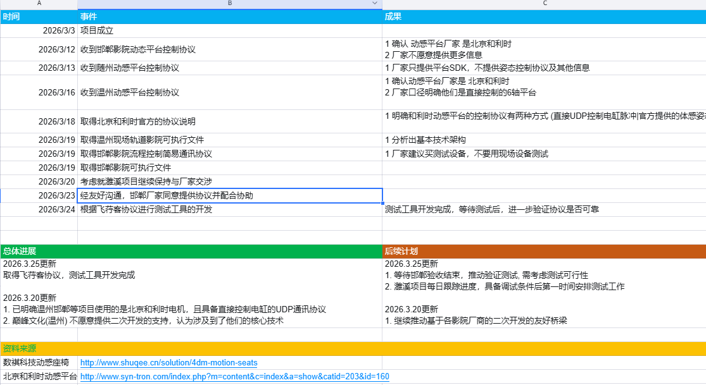

# 集成式动感平台播控系统 — 项目进度汇报

> **项目名称：** 集成式动感平台播控系统
> **汇报日期：** 2026 年 3 月 31 日
>
> **实际起始日期：** 2026-03-09

---

## 〇、团队分工

| 姓名   | 角色         | 负责模块                                                                |
| ------ | ------------ | ----------------------------------------------------------------------- |
| 马宝全 | 项目执行     | IODevice 动作核心、动作编辑器、影院视频播放器核心功能、整体影院技术架构 |
| 居向前 | 软件架构设计 | 业主端控制程序（影片控制 + 平台控制，与影院播放器通信实现）             |
| 邵向阳 | 功能模块设计 | 基于飞荇客等影院协议的 C++ DLL 封装开发                                 |
| 郝晓阳 | 功能模块设计 | Unity 插件集成                                                          |
| 穆大强 | 功能模块设计 | UE 插件集成                                                             |

---

## 一、进度总览

| 时间节点             | 进度安排                                     | 参与人员                 | 当前状态      | 完成度 |
| -------------------- | -------------------------------------------- | ------------------------ | ------------- | ------ |
| 2026 年 3 月 31 日前 | 产品原型设计及系统架构方案完成               | 马宝全                   | ✅ **已完成** | 100%   |
| 2026 年 4 月 30 日前 | 核心播控系统开发与基础联调完成               | 马宝全 / 居向前 / 邵向阳 | 🔧 进行中     | —      |
| 2026 年 5 月 15 日前 | 完成设备接口整合及动作编排优化               | 全员                     | 待启动        | —      |
| 2026 年 5 月 31 日前 | 系统整体测试优化完成，达到上线标准           | 全员                     | 待启动        | —      |
| 2026 年 6 月 30 日前 | 产品验收完成（含飞荇客对接 + Unity/UE 插件） | 全员                     | 待启动        | —      |

---

## 二、各节点详细交付清单与进度

---

### 节点一：2026 年 3 月 31 日前 — 产品原型设计及系统架构方案完成

**状态：✅ 已完成** | **负责人：马宝全**

本节点完成了产品原型设计与系统架构方案，包括架构设计、原型验证、播放引擎实现和时间轴编辑器基础框架搭建，以及动感平台厂家协议对接前期调研及测试工具开发。

#### 可演示成果

| 序号 | 成果                     | 演示内容                                                                          | 状态 |
| ---- | ------------------------ | --------------------------------------------------------------------------------- | ---- |
| 1    | **系统架构设计文档**     | 可查阅的完整架构文档，含技术选型、模块划分、数据流图、接口定义                    | ✅   |
| 2    | **开发实施计划**         | 完整的项目周期规划、任务分解、工时估算、甘特图                                    | ✅   |
| 3    | **动感文件格式规范**     | `.motion` JSON 格式 v1.0 定稿 + JSON Schema + 示例文件，可用文本编辑器打开查看    | ✅   |
| 4    | **播放引擎原型**         | 可运行演示：加载 .motion 文件 → 播放 → 插值计算 → 输出值实时变化 → 停止回中       | ✅   |
| 5    | **时间轴编辑器窗口骨架** | 可打开编辑器窗口，展示工具栏/轨道面板/属性区基础布局                              | ✅   |
| 6    | **飞荇客平台测试工具**   | 可运行的独立测试程序，界面含姿态控制、特效控制、播放控制、门控/车辆控制、通信日志 | ✅   |

#### 厂家对接事件脉络

| 时间 | 事件                                          | 成果                                                  |
| ---- | --------------------------------------------- | ----------------------------------------------------- |
| 3/3  | 项目成立                                      | —                                                     |
| 3/12 | 收到邯郸影院动态平台控制协议                  | 确认动感平台厂家为北京和利时，厂家不愿提供更多信息    |
| 3/13 | 收到随州动感平台控制协议                      | 厂家仅提供平台 SDK，不提供姿态控制协议                |
| 3/16 | 收到温州动感平台控制协议                      | 确认厂家为北京和利时，平台为直接控制的 6 轴平台       |
| 3/18 | 取得北京和利时官方协议说明                    | 明确两种控制方式：UDP 控制电缸脉冲 / 官方体感座椅 SDK |
| 3/19 | 取得温州现场轨道影院可执行文件                | 分析出基本技术架构                                    |
| 3/19 | 取得邯郸影院流程控制简易通讯协议 + 可执行文件 | 厂家建议购买测试设备，不必现场测试                    |
| 3/23 | 邯郸厂家同意提供协议并配合协助                | 建立合作关系，协议对接条件已具备                      |
| 3/24 | 基于飞荇客协议开发测试工具                    | 测试工具开发完成，等待设备到位后验证协议可靠性        |

#### 关键技术成果

- **动感文件格式稳定：** `.motion` JSON 格式 v1.0 定稿，支持多轨道、多片段、多关键帧，4 种插值方式通过 10000 帧验证
- **厂家合作建立：** 已与邯郸厂家建立协作关系，取得北京和利时官方协议，明确 UDP 控制电缸脉冲与体感座椅 SDK 两种控制方式
- **协议测试工具：** 飞荇客平台测试工具已开发完成，支持姿态控制 (Yaw/Pitch/Roll)、特效控制、播放控制、门控、车辆控制及通信日志

---

### 节点二：2026 年 4 月 30 日前 — 核心播控系统开发与基础联调完成

**状态：🔧 进行中** | **负责人：马宝全 / 居向前 / 邵向阳**

本节点目标为核心播控系统与基础联调。马宝全负责动作编辑器功能完善、影院播放器核心与 TCP 播控服务；居向前负责业主端控制程序架构设计与影片播放控制模块；邵向阳负责飞荇客协议 C++ DLL 架构设计与基础通讯层。

#### 可演示成果

| 序号                        | 成果                     | 演示内容                                                                    | 状态      |
| --------------------------- | ------------------------ | --------------------------------------------------------------------------- | --------- |
| **时间轴编辑器 — 完整可用** |                          |                                                                             |           |
| 1                           | **时间轴编辑器主界面**   | 可打开编辑窗口，展示专业级布局：上方视频预览+属性面板，下方时间轴           | ✅        |
| 2                           | **轨道编辑操作**         | 现场演示：添加轨道 → 双击添加关键帧 → 拖拽调整 → 删除 → 多选框选 → 复制粘贴 | ✅        |
| 3                           | **视图模式切换**         | Dopesheet（菱形关键帧视图）与 Curves（曲线编辑视图）实时切换                | ✅        |
| 4                           | **轨道分组与折叠**       | 按设备分组，可折叠/展开，右键菜单管理，拖拽归组                             | ✅        |
| 5                           | **撤销/重做**            | Ctrl+Z/Y 演示：添加关键帧→撤销消失→重做恢复，覆盖所有编辑操作               | ✅        |
| 6                           | **自动保存与未保存提示** | 编辑后标题栏显示 \*号，定时自动保存，关闭时提示保存                         | ✅        |
| **播放与预览**              |                          |                                                                             |           |
| 7                           | **播放控制演示**         | 点击▶播放 → 播放头实时移动 + 时间显示递增 + 设备输出值同步变化              | ✅        |
| 8                           | **视频同步播放**         | 加载视频文件 → 播放时视频与时间轴完全同步 → 拖拽播放头视频帧跳转            | ✅        |
| 9                           | **视频全屏**             | 双击视频区域进入全屏预览，滚轮缩放                                          | ✅        |
| 10                          | **音频波形显示**         | 时间轴顶部显示音频波形图，辅助动作编排对齐音乐节拍                          | ✅        |
| **导出功能**                |                          |                                                                             |           |
| 11                          | **导出 .motion 文件**    | 编辑完成后导出为 .motion JSON 文件，可用文本编辑器查看内容                  | ✅        |
| 12                          | **导出配置对话框**       | 导出前可配置参数的 UI 对话框                                                | ✅        |
| 13                          | **.mtn 加密导出**        | 导出加密发行版 .mtn 文件（AES-256-GCM）                                     | 🔧 待完成 |
| **快捷键体系**              |                          |                                                                             |           |
| 14                          | **键盘快捷键演示**       | Space(播放) / K(添加关键帧) / Del(删除) / Ctrl+C/V(复制粘贴) / M(标记) 等   | ✅        |
| 15                          | **事件和标记系统**       | 时间标尺上可见的事件标记和书签，Ctrl+←/→ 快速跳转                           | ✅        |

#### 待完成项（4 月 30 日前需交付）

| 序号 | 任务                    | 负责人 | 预期可演示成果                                             | 预估工时 |
| ---- | ----------------------- | ------ | ---------------------------------------------------------- | -------- |
| 1    | .mtn 加密导出           | 马宝全 | 导出的 .mtn 文件无法用文本编辑器查看，但可被播放器记载播放 | 6h       |
| 2    | TCP 网络播控服务        | 马宝全 | Python 脚本连接 IOStudio 发送播放/暂停/停止命令，设备响应  | 18h      |
| 3    | 端到端联调              | 马宝全 | 完整演示：编辑→导出→TCP加载→设备播放                       | 4h       |
| 4    | 影院视频播放器核心      | 马宝全 | 视频文件加载/播放/暂停/同步控制                            | 16h      |
| 5    | 业主端控制程序架构设计  | 居向前 | 技术方案文档，UI 框架原型                                  | 12h      |
| 6    | 影片播放控制模块        | 居向前 | 片单管理/播放/暂停/停止可演示                              | 16h      |
| 7    | 飞荇客协议 DLL 架构设计 | 邵向阳 | DLL 工程框架、协议规范文档                                 | 8h       |
| 8    | 基础通讯层实现          | 邵向阳 | TCP/UDP 连接管理、心跳、重连                               | 12h      |

---

### 节点三：2026 年 5 月 15 日前 — 完成设备接口整合及动作编排优化

**状态：待启动** | **负责人：全员**

本节点目标为设备接口整合及动作编排优化。马宝全负责 C++ MotionPlayer 实现；居向前负责平台控制与播放器通信；邵向阳负责 DLL 核心封装；郝晓阳启动 Unity 插件开发；穆大强启动 UE 插件开发。

#### 可演示成果

| 序号             | 成果                     | 演示内容                                                                     | 状态 |
| ---------------- | ------------------------ | ---------------------------------------------------------------------------- | ---- |
| **曲线编辑器**   |                          |                                                                              |      |
| 1                | **贝塞尔曲线精编**       | 切换到 Curves 视图 → 拖拽贝塞尔控制手柄 → 实时曲线更新 → 平滑的加速/减速效果 | ✅   |
| 2                | **插值类型切换**         | 右键菜单切换 Linear/Bezier/Step/EaseInOut，曲线实时变化                      | ✅   |
| 3                | **曲线预设应用**         | 右键选择预设曲线（如“快进慢出”“弹跳”），一键应用到选中关键帧                 | ✅   |
| **设备接口整合** |                          |                                                                              |      |
| 4                | **多类型输出通道**       | 添加轨道时可选择 OAxis 输出轴 / OAction 动作 / Bool 开关，播放时设备实际响应 | ✅   |
| 5                | **轨道值类型区分**       | Float 轨道显示平滑曲线，Bool 轨道显示阶梯波形，属性面板自动切换              | ✅   |
| **动作编排优化** |                          |                                                                              |      |
| 6                | **吸附对齐工具**         | 开启吸附后，拖拽关键帧自动对齐到网格/其他关键帧/播放头                       | ✅   |
| 7                | **工作区域标记**         | I/O 键设置入/出点，限定播放和导出范围                                        | ✅   |
| 8                | **深色/浅色主题**        | 切换 Dark/Light 主题，全界面风格统一变化                                     | ✅   |
| 9                | **轨道片段内嵌曲线预览** | 轨道片段内直接显示小型曲线预览，无需切换 Curves 视图                         | ✅   |

#### 待完成项（5 月 15 日前需交付）

| 序号 | 任务                      | 负责人 | 预期可演示成果                                         | 预估工时 |
| ---- | ------------------------- | ------ | ------------------------------------------------------ | -------- |
| 1    | C++ MotionPlayer 实现     | 马宝全 | Unity/UE 无需 IOStudio 进程，直接调用 DLL 驱动设备运动 | 31.5h    |
| 2    | C Wrapper + C# Wrapper    | 马宝全 | P/Invoke 调用 MotionLoad/Play/Stop 成功                | 8h       |
| 3    | 动感平台控制模块          | 居向前 | 平台启停/姿态控制/状态监控                             | 16h      |
| 4    | 与影院播放器通信接口      | 居向前 | 业主端与播放器通信联动                                 | 12h      |
| 5    | 飞荇客指令处理 + 状态回传 | 邵向阳 | 飞荇客指令→设备运动，状态回传到平台                    | 20h      |
| 6    | Unity Package + 运行时    | 郝晓阳 | UPM 工程结构 + MotionClient + MotionPlayerComponent    | 19h      |
| 7    | UE 插件 + FMotionClient   | 穆大强 | 插件工程结构 + TCP 路径 + AMotionPlayerActor           | 18h      |

---

### 节点四：2026 年 5 月 31 日前 — 系统整体测试优化完成，达到上线标准

**状态：待启动** | **负责人：全员**

本节点目标为系统整体测试优化。马宝全负责效果预设与性能优化；居向前负责业主端联调；邵向阳负责协议联调；郝晓阳负责 Unity 编辑器扩展；穆大强负责 UE 蓝图与编辑器扩展。

#### 可演示成果

| 序号               | 成果                       | 演示内容                                                           | 状态      |
| ------------------ | -------------------------- | ------------------------------------------------------------------ | --------- |
| **媒体同步**       |                            |                                                                    |           |
| 1                  | **视频+动感同步播放**      | 加载视频文件 → 编辑关键帧对齐视频内容 → 播放时视频+座椅完全同步    | ✅        |
| 2                  | **音频波形辅助编排**       | 时间轴顶部显示音频波形，可视化对齐动作与音乐节拍                   | ✅        |
| **测试体系**       |                            |                                                                    |           |
| 3                  | **单元测试报告**           | 可运行测试套件，输出测试通过率报告（模型/服务/ViewModel 三层覆盖） | ✅        |
| **效果预设库**     |                            |                                                                    |           |
| 4                  | **预设效果拖入时间轴**     | 从预设库浏览→拖拽“下坠”“颠簇”“转弯”等效果到轨道→自动生成关键帧     | 🔧 待完成 |
| **飞荇客平台联动** |                            |                                                                    |           |
| 5                  | **飞荇客平台指令驱动设备** | 飞荇客平台发送动感指令 → IOStudio 接收 → 座椅实际运动              | 🔧 待完成 |
| 6                  | **状态回传监控**           | IOStudio 界面实时显示飞荇客连接状态、设备状态回传信息              | 🔧 待完成 |

#### 待完成项（5 月 31 日前需交付）

| 序号 | 任务                        | 负责人 | 预期可演示成果                                         | 预估工时 |
| ---- | --------------------------- | ------ | ------------------------------------------------------ | -------- |
| 1    | 效果预设系统                | 马宝全 | 预设库面板 → 拖拽到轨道 → 自动生成关键帧               | 16h      |
| 2    | 性能优化                    | 马宝全 | >1000 关键帧场景操作流畅，>30fps                       | 3h       |
| 3    | Bug 回归修复                | 马宝全 | 全功能回归测试通过                                     | 4h       |
| 4    | 业主端 ↔ 播放器联调         | 居向前 | 端到端联调通过，异常处理完善                           | 12h      |
| 5    | 飞荇客平台联调测试          | 邵向阳 | 飞荇客指令→设备运动，联调通过                          | 9h       |
| 6    | 协议异常处理                | 邵向阳 | 协议错误/连接断开/指令冲突处理                         | 6h       |
| 7    | Unity 编辑器扩展 + P/Invoke | 郝晓阳 | Inspector/Preview Window/.motion Importer + 嵌入式路径 | 16h      |
| 8    | UE 蓝图 + 编辑器扩展        | 穆大强 | 蓝图函数库/Motion Asset/编辑器扩展/嵌入式路径          | 19h      |

---

### 节点五：2026 年 6 月 30 日前 — 产品验收完成

**状态：待启动** | **负责人：全员**

本节点为最终产品验收。马宝全负责授权系统集成与安装包打包；居向前负责业主端优化与部署；邵向阳负责 DLL 文档与稳定性测试；郝晓阳负责 Unity Demo 与 UPM 发布；穆大强负责 UE Demo 与插件发布。

#### 可演示成果（规划）

| 序号               | 成果                         | 负责人          | 演示内容                                                                | 状态      |
| ------------------ | ---------------------------- | --------------- | ----------------------------------------------------------------------- | --------- |
| **授权系统**       |                              |                 |                                                                         |           |
| 1                  | **Basic/Pro 双模式演示**     | 马宝全          | 无授权启动→Pro功能显示🔒→导入License→解锁全部功能                       | 🔧 待完成 |
| 2                  | **授权管理界面**             | 马宝全          | 设置面板查看授权状态/激活/注销的完整 UI                                 | 🔧 待完成 |
| **业主端控制程序** |                              |                 |                                                                         |           |
| 3                  | **业主端影片控制**           | 居向前          | 片单管理 + 影片播放/暂停/停止 + 动感平台联动                            | 🔧 待完成 |
| 4                  | **业主端部署**               | 居向前          | 现场部署方案 + 操作手册                                                 | 🔧 待完成 |
| **飞荇客协议 DLL** |                              |                 |                                                                         |           |
| 5                  | **协议 DLL 集成**            | 邵向阳          | 飞荇客平台指令→IODevice→设备运动（完整链路）                            | 🔧 待完成 |
| 6                  | **DLL API 文档**             | 邵向阳          | 完整接口说明+集成指南                                                   | 🔧 待完成 |
| **Unity 插件**     |                              |                 |                                                                         |           |
| 7                  | **Unity 编辑器集成**         | 郝晓阳          | 通过 Package Manager 导入插件→Inspector面板配置→编辑器内预览.motion曲线 | 🔧 待完成 |
| 8                  | **Unity 视频+动感联动 Demo** | 郝晓阳          | 运行 CinemaDemo 场景：VideoPlayer 播取视频同时座椅同步运动              | 🔧 待完成 |
| 9                  | **Unity VR 过山车 Demo**     | 郝晓阳          | 运行 VRCoasterDemo 场景：VR 视角与动感座椅联动                          | 🔧 待完成 |
| **UE 插件**        |                              |                 |                                                                         |           |
| 10                 | **UE 蓝图集成**              | 穆大强          | 启用插件→蓝图编辑器中拖入Motion节点→连接并播放                          | 🔧 待完成 |
| 11                 | **UE 动感联动 Demo 关卡**    | 穆大强          | 运行 Demo 关卡：蓝图触发动感效果，座椅实际运动                          | 🔧 待完成 |
| **发布产品**       |                              |                 |                                                                         |           |
| 12                 | **IOStudio.exe 安装包**      | 马宝全          | 可直接发放的单一可执行文件，含 Basic/Pro 双模式                         | 🔧 待完成 |
| 13                 | **Unity 插件包 (UPM)**       | 郝晓阳          | com.iotoolkit.motion 可发布包，拖入Unity即用                            | 🔧 待完成 |
| 14                 | **UE 插件包 (.uplugin)**     | 穆大强          | IOToolkitMotion 可发布插件，导入UE即用                                  | 🔧 待完成 |
| **文档**           |                              |                 |                                                                         |           |
| 15                 | **用户操作手册**             | 马宝全          | IOStudio 内置帮助文档，可查阅的图文操作指南                             | 🔧 待完成 |
| 16                 | **TCP 播控协议 API 文档**    | 马宝全          | 完整的网络接口说明，可供第三方开发者参考                                | 🔧 待完成 |
| 17                 | **业主端操作手册**           | 居向前          | 业主端控制程序使用说明                                                  | 🔧 待完成 |
| 18                 | **Unity/UE 集成指南**        | 郝晓阳 / 穆大强 | 插件安装步骤 + API 参考 + 常见问题                                      | 🔧 待完成 |
| **验收测试**       |                              |                 |                                                                         |           |
| 19                 | **端到端全流程演示**         | 全员            | 完整演示：编辑→导出→加密→TCP加载→设备播放→飞荇客联动                    | 🔧 待完成 |
| 20                 | **多设备兼容性验证**         | 全员            | 不同型号座椅/平台设备测试结果                                           | 🔧 待完成 |

---

## 三、整体进度评估

### 当前进度概况（2026-04-13 基线）

```
时间进度：████████████░░░░░░░░░░░░░░░░░░  35/113 天 (31.0%)
功能进度：████████████████████░░░░░░░░░░  ~65% 核心功能已完成
编辑器：  █████████████████████████████░  95% (仅缺 .mtn 加密)
C++ 层：  ░░░░░░░░░░░░░░░░░░░░░░░░░░░░░░  0% (计划节点三实施)
网络层：  ░░░░░░░░░░░░░░░░░░░░░░░░░░░░░░  0% (计划节点二完成)
插件层：  ░░░░░░░░░░░░░░░░░░░░░░░░░░░░░░  0% (计划节点三-五)
```

### 阶段完成情况（2026-04-13 代码审查基线）

| 阶段           | 内容                   | 计划周期    | 实际状态  | 代码验证说明                                              |
| -------------- | ---------------------- | ----------- | --------- | --------------------------------------------------------- |
| Phase 1        | 数据模型 + 播放引擎    | W01-W03     | ✅ 已完成 | 13 个数据模型 + PlaybackEngine/Interpolation/Safety 完整  |
| Phase 2        | 时间轴编辑器 UI        | W03-W06     | ✅ 已完成 | 10 个自定义控件 + 4 个对话框 + 16 个 ViewModel            |
| Phase 2.5      | 编辑器增强             | W06+        | ✅ 已完成 | UndoRedoService + KeyboardShortcutService + 自动保存      |
| Phase 3        | 播放预览 + 导出        | W07-W09     | 🔧 90%    | MotionExportService ✅; **MotionCryptoService ❌ 未实现** |
| Phase 4        | 曲线编辑器             | W09-W10     | ✅ 已完成 | CurveEditorControl + CurvePresetService (10种预设)        |
| Phase 4.5-4.15 | 架构改进全系列         | W10-W12     | ✅ 已完成 | 10 个接口 + partial class 拆分 + DI                       |
| Phase 5        | 媒体同步               | W11-W12     | ✅ 已完成 | LibVlcVideoPlayerService + AudioWaveformExtractor + Beat  |
| Phase 6        | 效果预设               | W13-W14     | ⏸️ 未开始 | CurvePresetService≠效果模板，需新建预设库系统             |
| Phase 0→7      | C++ MotionPlayer       | W13-W14     | ⏸️ 未开始 | IODevice C++ 项目无任何 Motion 代码                       |
| Phase 1b       | TCP MotionServer       | W15-W16     | ⏸️ 未开始 | 无 MotionServerService/MotionCommandHandler 类            |
| Phase 7→9      | LicHper 授权 + 打磨    | W17-W18     | ⏸️ 未开始 | 项目中无 LicHper/License/Auth 文件                        |
| Phase 8→10     | Unity/UE SDK           | W19-W20     | ⏸️ 未开始 | —                                                         |
| **Phase 9**    | **飞荇客平台协议对接** | **W15-W17** | ⏸️ 未开始 | 归邵向阳，独立 C++ DLL 项目                               |
| **Phase 10**   | **Unity 插件开发**     | **W18-W19** | ⏸️ 未开始 | 归郝晓阳                                                  |
| **Phase 11**   | **UE 插件开发**        | **W19-W20** | ⏸️ 未开始 | 归穆大强                                                  |

### 代码级实施验证（2026-04-13 架构审查）

> 以下分析基于代码仓库实际内容的逐文件审查，非进度汇报自述。

#### 已完成模块 — 代码验证通过

| 模块                          | 文件数           | 核心类/接口                                                                                                                                                         | 代码验证结论                                       |
| ----------------------------- | ---------------- | ------------------------------------------------------------------------------------------------------------------------------------------------------------------- | -------------------------------------------------- |
| **数据模型 (Models/Motion/)** | 13               | MotionTimeline, MotionTrack, MotionClip, MotionKeyframe, MotionEvent, TimelineEvent, TimelineMarker, TrackGroup, PlaybackState, TimelineViewMode, ShortcutAction 等 | ✅ 全部实现，含事件/标记/分组等增量扩展            |
| **播放引擎**                  | 1 (12.5KB)       | MotionPlaybackEngine — 状态机 (Idle→Playing⇄Paused→Stopping→Idle), Tick 驱动                                                                                        | ✅ 完整实现：速度控制、循环、Seek、SmoothStep 回中 |
| **插值引擎**                  | 1 (4.7KB)        | InterpolationEngine — Linear/Bezier/Step/EaseInOut，二分查找 O(log n)                                                                                               | ✅ 完整实现                                        |
| **安全保护**                  | 1 (3.7KB)        | SafetyGuard — Clamp + 速度限制 + SmoothStep 回中生成器                                                                                                              | ✅ 完整实现                                        |
| **设备分发**                  | 1 (4.5KB)        | DeviceDispatcher — OAction + OAxis 分发至 IOToolkit.SetDO()                                                                                                         | ✅ 完整实现                                        |
| **文件读写**                  | 1 (4.0KB)        | MotionFileReader — JSON 读写                                                                                                                                        | ✅ JSON 完整；⚠️ .mtn 加密为 stub（仅检测扩展名）  |
| **导出服务**                  | 1 (10.5KB)       | MotionExportService — .motion JSON + CSV + CompactJson                                                                                                              | ✅ 三种导出格式均已实现                            |
| **Undo/Redo**                 | 1 (4.7KB)        | UndoRedoService — Command 模式，100 级栈，批量分组                                                                                                                  | ✅ 完整实现                                        |
| **快捷键**                    | 1 (3.2KB)        | KeyboardShortcutService — Ctrl 组合键 + 上下文感知                                                                                                                  | ✅ 完整实现                                        |
| **曲线预设**                  | 1 (7.2KB)        | CurvePresetService — 10 种内置预设，按分类分组                                                                                                                      | ✅ 完整实现                                        |
| **标记服务**                  | 1 (7.8KB)        | MarkerService — CRUD + Undo 集成 + 导航                                                                                                                             | ✅ 完整实现                                        |
| **视频播放**                  | 1 (6.7KB)        | LibVlcVideoPlayerService — 懒加载 LibVLC, HWND 缓存, 完整播控                                                                                                       | ✅ 完整实现 (依赖 LibVLCSharp 3.9.3)               |
| **音频波形**                  | 1 (12.9KB)       | AudioWaveformExtractor — LibVLC PCM 捕获 + 渐进式更新                                                                                                               | ✅ 完整实现                                        |
| **节拍检测**                  | 1 (4.7KB)        | BeatDetector — 能量阈值 + 滑动窗口 + 最小间隔过滤                                                                                                                   | ✅ 完整实现                                        |
| **接口层**                    | 10               | IPlaybackEngine, IUndoRedoService, IInterpolationEngine, IVideoPlayerService 等                                                                                     | ✅ 全部定义并实现                                  |
| **ViewModel**                 | 16 (7 partial)   | TimelineEditorViewModel (6 个 partial 文件), TrackVM, ClipVM, CurveEditorVM, KeyframePropertyVM 等                                                                  | ✅ 完整实现                                        |
| **自定义控件**                | 10 + 3 Behaviors | CurveEditorControl, TimeRulerControl, TrackClipControl, PlayheadOverlay, WaveformControl, VlcVideoHost 等                                                           | ✅ 完整实现                                        |
| **Views**                     | 4 对话框         | TimelineEditorWindow, AddTrackDialog, ExportDialog, GroupDialog                                                                                                     | ✅ 完整实现                                        |

#### 未实现模块 — 代码不存在

| 模块                        | 计划阶段           | 代码现状      | 详情                                                                                     |
| --------------------------- | ------------------ | ------------- | ---------------------------------------------------------------------------------------- |
| **.mtn AES-256-GCM 加密**   | Phase 3 Sprint 3.3 | ❌ **stub**   | `MotionFileReader.IsEncrypted()` 仅检查扩展名；无 `MotionCryptoService` 类；无加密库依赖 |
| **TCP MotionServer**        | Phase 1b           | ❌ **不存在** | 无 `MotionServerService` / `MotionCommandHandler` 类；端口 9600 协议未实现               |
| **影院视频播放器核心**      | 节点二             | ❌ **不存在** | LibVlcVideoPlayerService 仅服务于编辑器内预览，非独立影院播放器                          |
| **效果预设系统**            | Phase 6            | ❌ **不存在** | CurvePresetService 仅提供曲线形状预设，非效果模板（如"下坠""颠簸"等）                    |
| **C++ MotionPlayer**        | Phase 0→7          | ❌ **不存在** | IODevice C++ 项目中无 MotionPlayer.h/.cpp；IODeviceController.cpp 未修改                 |
| **C Wrapper Motion 函数**   | Phase 0 Sprint 0.2 | ❌ **不存在** | IODevice_CWrapper.h 中无 Motion\* 函数声明                                               |
| **C# Wrapper MotionPlayer** | Phase 0 Sprint 0.3 | ❌ **不存在** | IOToolkit 命名空间无 MotionPlayer 静态类                                                 |
| **LicHper 授权系统**        | Phase 7→9          | ❌ **不存在** | 项目中无 LicHper/License/Auth 相关文件                                                   |
| **飞荇客协议 DLL**          | Phase 9            | ❌ **不存在** | 归邵向阳负责，独立 C++ DLL 项目                                                          |
| **Unity 插件**              | Phase 10           | ❌ **不存在** | 归郝晓阳负责                                                                             |
| **UE 插件**                 | Phase 11           | ❌ **不存在** | 归穆大强负责                                                                             |

#### 架构质量评估

| 维度           | 评估      | 详情                                                                            |
| -------------- | --------- | ------------------------------------------------------------------------------- |
| **代码组织**   | 🟢 良好   | Services/Motion 24 文件、ViewModels/Timeline 16 文件、10 个接口定义，职责分明   |
| **MVVM 规范**  | 🟢 良好   | TimelineEditorViewModel 使用 partial class 拆分 7 个文件，可维护性好            |
| **安全性设计** | 🟢 良好   | SafetyGuard 速度限制 + Clamp + 回中保护，防止设备损坏                           |
| **性能设计**   | 🟢 良好   | InterpolationEngine O(log n) 二分查找，DeltaTime 上限 100ms                     |
| **NuGet 版本** | 🟡 有隐患 | `Avalonia.Controls.ItemsRepeater` 11.1.5 vs 其他 Avalonia 包 11.3.10 版本不一致 |
| **目标框架**   | 🟡 需关注 | `net6.0` 已于 2024 年 11 月停止支持，建议升级至 `net8.0`                        |
| **测试覆盖**   | 🔴 不足   | 仅 3 个测试文件 (UndoRedo/Serialization/KeyframeProperty)，核心引擎无测试覆盖   |

### 进度偏差分析

| 维度           | 评估                                                                                                                                  |
| -------------- | ------------------------------------------------------------------------------------------------------------------------------------- |
| **编辑器功能** | 🟢 Phase 1-5 + Phase 4.5-4.15 已全部完成，编辑器核心功能完整可用                                                                      |
| **节点二剩余** | 🟡 .mtn 加密(6h) + TCP 播控(18h) + 影院播放器(16h) + 联调(4h) = **~44h，约 5.5 个工作日**，距截止日 4/30 还剩约 12 个工作日，时间充裕 |
| **技术风险**   | 🟢 核心技术方案验证通过，编辑器可正常运行                                                                                             |
| **质量状态**   | 🟡 代码质量良好但测试覆盖不足，核心引擎（PlaybackEngine/InterpolationEngine/SafetyGuard）无单元测试                                   |
| **待攻关项**   | 🟡 TCP MotionServer 协议实现（依赖 ConnectionManager 现有架构可复用）、C++ MotionPlayer（需 .motion 格式完全稳定后实施）              |

### 风险提示

| 风险项                   | 等级  | 影响                                                   | 缓解措施                                                     |
| ------------------------ | ----- | ------------------------------------------------------ | ------------------------------------------------------------ |
| .mtn 加密延迟            | 🟡 中 | C++ MotionPlayer 需解密 .mtn，加密方案未定阻塞 Phase 0 | 优先完成加密模块，锁定加密方案 (AES-256-GCM)                 |
| TCP MotionServer 复杂度  | 🟡 中 | 14 种命令 + 50ms 状态推送 + 心跳超时急停，实现量大     | 现有 `ConnectionManager.TcpServerSender` 可复用 TCP 基础设施 |
| C++ 层与 C# 层行为一致性 | 🟡 中 | 编辑器预览效果与嵌入式播放不一致                       | 先锁定 .motion 格式和插值算法，C++ 层严格照搬 C# 逻辑        |
| Avalonia 版本不一致      | 🟡 低 | `ItemsRepeater` 11.1.5 可能在运行时出现兼容性问题      | 统一升级至 11.3.10                                           |
| 测试覆盖不足             | 🟡 中 | 引擎层 bug 可能在联调阶段暴露                          | 节点三前补齐核心引擎单元测试                                 |
| 授权系统集成             | 🟡 中 | LicHper DLL 集成调试周期不确定                         | 提前准备模拟接口，降低耦合                                   |
| 飞荇客协议对接           | 🟡 中 | 协议文档不完整或变更                                   | 已开发测试工具验证协议，搭建模拟器保证可测试性               |
| Unity/UE 插件跨版本兼容  | 🟡 低 | 不同引擎版本差异                                       | 以主流版本为基线，最小化外部依赖                             |

---

## 四、更新后的实施计划（2026-04-13 基线）

> 基于代码级架构审查重新排布，以各节点截止日期为锚点倒排。

### 节点二剩余任务（截止 4/30，剩余 12 个工作日）

| 优先级 | 任务                                               | 负责人 | 预估工时 | 计划周期  | 前置依赖                    |
| ------ | -------------------------------------------------- | ------ | -------- | --------- | --------------------------- |
| P0     | .mtn AES-256-GCM 加密导出 + 解密加载               | 马宝全 | 6h       | 4/14-4/15 | 无                          |
| P0     | TCP MotionServer (端口 9600, JSON 协议, 14 种命令) | 马宝全 | 18h      | 4/16-4/21 | PlaybackEngine ✅           |
| P0     | 影院视频播放器核心功能 (独立播放窗口 + 控制接口)   | 马宝全 | 16h      | 4/22-4/25 | LibVlcVideoPlayerService ✅ |
| P1     | 端到端联调：编辑→导出→TCP 加载→设备播放            | 马宝全 | 4h       | 4/28-4/29 | 以上全部                    |
| P1     | Buffer / Bug 修复                                  | 马宝全 | 8h       | 4/29-4/30 | —                           |
| —      | 业主端控制程序架构设计 + 影片播放控制模块          | 居向前 | 28h      | 4/14-4/30 | —                           |
| —      | 飞荇客协议 DLL 架构 + 基础通讯层                   | 邵向阳 | 20h      | 4/14-4/30 | —                           |

### 节点三任务（截止 5/15，10 个工作日）

| 优先级 | 任务                                                              | 负责人 | 预估工时 | 计划周期  | 前置依赖         |
| ------ | ----------------------------------------------------------------- | ------ | -------- | --------- | ---------------- |
| P0     | C++ MotionPlayer 类 (pImpl, JSON 解析, 插值, 安全保护, .mtn 解密) | 马宝全 | 21h      | 5/1-5/6   | .mtn 加密方案 ✅ |
| P0     | IODeviceController::Update() 集成 MotionPlayer::Tick()            | 马宝全 | 1h       | 5/6       | MotionPlayer 类  |
| P0     | C Wrapper 13 个 Motion\* 函数                                     | 马宝全 | 3h       | 5/7       | C++ MotionPlayer |
| P0     | C# Wrapper IOToolkit.MotionPlayer 静态类                          | 马宝全 | 3.5h     | 5/8       | C Wrapper        |
| P1     | 核心引擎单元测试补齐 (PlaybackEngine/Interpolation/SafetyGuard)   | 马宝全 | 6h       | 5/9-5/12  | —                |
| P2     | Avalonia 版本统一 + net6.0→net8.0 升级评估                        | 马宝全 | 4h       | 5/13-5/14 | —                |
| —      | 动感平台控制模块 + 播放器通信接口                                 | 居向前 | 28h      | 5/1-5/15  | —                |
| —      | 飞荇客指令处理 + 状态回传 + 通道映射                              | 邵向阳 | 20h      | 5/1-5/15  | —                |
| —      | Unity UPM Package + MotionClient + MotionPlayerComponent          | 郝晓阳 | 19h      | 5/1-5/15  | C# Wrapper       |
| —      | UE Plugin + FMotionClient + AMotionPlayerActor                    | 穆大强 | 18h      | 5/1-5/15  | C Wrapper        |

### 节点四任务（截止 5/31，12 个工作日）

| 优先级 | 任务                                                        | 负责人 | 预估工时 | 计划周期  | 前置依赖              |
| ------ | ----------------------------------------------------------- | ------ | -------- | --------- | --------------------- |
| P1     | 效果预设系统 (预设库面板 + 拖拽到轨道 + 自动生成关键帧)     | 马宝全 | 16h      | 5/16-5/20 | CurvePresetService ✅ |
| P1     | 性能优化 (>1000 关键帧 >30fps)                              | 马宝全 | 3h       | 5/21      | —                     |
| P2     | 系统级端到端联调 (IOStudio + C++ MotionPlayer + 飞荇客 DLL) | 马宝全 | 8h       | 5/22-5/26 | 节点三全部            |
| P2     | Bug 回归修复 + 全功能测试                                   | 马宝全 | 4h       | 5/27-5/28 | —                     |
| —      | 业主端 ↔ 播放器联调 + 异常处理                              | 居向前 | 12h      | 5/16-5/31 | —                     |
| —      | 飞荇客平台联调 + 异常处理 + 性能测试                        | 邵向阳 | 15h      | 5/16-5/31 | —                     |
| —      | Unity 编辑器扩展 + P/Invoke 嵌入式路径                      | 郝晓阳 | 16h      | 5/16-5/31 | —                     |
| —      | UE 蓝图 + 编辑器扩展 + 嵌入式路径                           | 穆大强 | 19h      | 5/16-5/31 | —                     |

### 节点五任务（截止 6/30，22 个工作日）

| 优先级 | 任务                                    | 负责人 | 预估工时 | 计划周期  |
| ------ | --------------------------------------- | ------ | -------- | --------- |
| P0     | LicHper 授权集成 (Basic/Pro 运行时分级) | 马宝全 | 12h      | 6/1-6/6   |
| P1     | IOStudio.exe 安装包打包                 | 马宝全 | 8h       | 6/7-6/10  |
| P1     | 用户操作手册 + TCP 播控协议 API 文档    | 马宝全 | 12h      | 6/11-6/16 |
| P2     | 全流程验收测试支持                      | 马宝全 | 8h       | 6/17-6/25 |
| P2     | Buffer / 紧急 Bug 修复                  | 马宝全 | 8h       | 6/25-6/30 |
| —      | 业主端优化 + 部署 + 操作手册            | 居向前 | 16h      | 6/1-6/30  |
| —      | DLL API 文档 + 集成指南 + 稳定性测试    | 邵向阳 | 12h      | 6/1-6/30  |
| —      | Unity Demo 场景 + 文档 + UPM 发布       | 郝晓阳 | 16h      | 6/1-6/30  |
| —      | UE Demo 关卡 + 文档 + .uplugin 发布     | 穆大强 | 16h      | 6/1-6/30  |

### 关键路径

```
.mtn 加密 (4/15) → TCP MotionServer (4/21) → 端到端联调 (4/29)   ← 节点二
                ↘
                  C++ MotionPlayer (5/6) → C/C# Wrapper (5/8)     ← 节点三
                                              ↓
                                    Unity/UE 插件可启动 (5/8+)
                                              ↓
                  效果预设 (5/20) → 系统联调 (5/26)                ← 节点四
                                              ↓
                  LicHper (6/6) → 打包 (6/10) → 文档 (6/16) → 验收 ← 节点五
```

### 待优化技术事项（非阻塞，穿插处理）

| 事项                                                                         | 优先级 | 建议时机                   |
| ---------------------------------------------------------------------------- | ------ | -------------------------- |
| 统一 `Avalonia.Controls.ItemsRepeater` 至 11.3.10                            | 🟡 中  | 节点三 C# 修改期间一并处理 |
| `net6.0` → `net8.0` 升级                                                     | 🟡 中  | 节点三评估，节点五执行     |
| 核心引擎单元测试 (PlaybackEngine/Interpolation/SafetyGuard/DeviceDispatcher) | 🟡 中  | 节点三安排 6h 集中补齐     |
| UndoRedoService MaxUndoLevels 底部移除不精确                                 | 🟢 低  | 随修随改                   |
| MotionExportService 缺少 .mtn 加密导出路径                                   | 🔴 高  | 节点二 Sprint 3.3 必须完成 |

---

> **总结（2026-04-13）：** 编辑器核心功能（Phase 1-5 + 架构改进）已全部完成，代码质量良好。当前处于节点二交付期，剩余 .mtn 加密（6h）、TCP 播控（18h）、影院播放器（16h）、联调（4h）共计 ~44h 工时，12 个工作日内可完成。后续节点的关键路径为：.mtn 加密方案锁定 → C++ MotionPlayer → C/C# Wrapper → Unity/UE 插件启动。各节点工时充裕，按计划推进即可。
